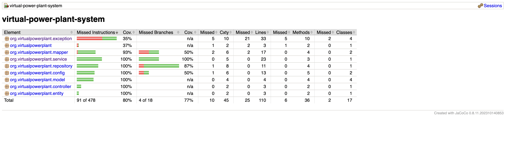

# Virtual Power Plant System

## Overview

This project implements a Virtual Power Plant (VPP) system that manages a network of batteries. It
provides REST APIs for battery registration and statistical analysis of battery capacities within
specified ranges.

## Technical Stack

- Java 21 (with Virtual Threads support)
- Spring Boot
- Spring Data JPA
- TestContainers
- REST Assured
- JUnit 5
- Mockito
- Lombok
- PostgreSQL

## Architecture Decisions

1. A layered architecture using Spring Boot with clear separation between:
    - REST Controllers (API layer)
    - Service layer (business logic)
    - Repository layer (data access)
    - DTOs for request/response handling
2. MapStruct for object mapping between entities and DTOs
3. Spring Data JPA for data persistence
4. Virtual threads for handling concurrent operations
5. Validation using Jakarta validation framework

## Testing Strategy

- Unit Tests: Testing service layer with Mockito
- Integration Tests: Using TestContainers for database integration tests
- API Tests: Using REST Assured for endpoint testing
- Concurrent Testing: Implementation of virtual threads for load testing

## Performance Considerations

- Utilized Virtual Threads for handling concurrent requests efficiently
- Implemented batch processing for battery registration
- Used JPA batch operations for database performance

## Local Development Setup Guide

## Prerequisites

- JDK 21 or later
- Docker and Docker Compose
- Gradle 8.5 or later (or use the included Gradle wrapper)
- Git

## Clone Repository

```bash
  git clone https://github.com/coder-shankar/virtual-power-plant-system
  cd virtual-power-plant-system
```

## Option 1: Gradle Setup (Direct)

### Build and Test

## Using Gradle wrapper

```bash
  ./gradlew clean build
````

## Run tests

```bash
  ./gradlew test
````

## Run application

```bash
  ./gradlew bootRun
```

### Configuration

Create `application-local.yml` in `src/main/resources

### Database Setup (PostgreSQL)

```bash
  docker run --name postgres-battery
   -e POSTGRES_DB=vpp_db
   -e POSTGRES_USER=postgres
   -e POSTGRES_PASSWORD=postgres
   -p 5432:5432
   -d postgres:16-alpine
```

## Option 2: Docker Setup

## Build an application

```bash
  ./gradlew clean build
```

## Docker compose

```bash
  docker-compose up --build
```

## Health API
```bash
  curl http://localhost:8080/actuator/health
```

## Testing Coverage

```bash
  ./gradlew test jacocoMergedReport
  
```

1. **Unit Tests**
    - Battery registration
    - Statistics calculation
    - Edge cases and validation

2. **Integration Tests**
    - API endpoint testing
    - Request/Response validation
    - Concurrent request handling
    - Database integration


